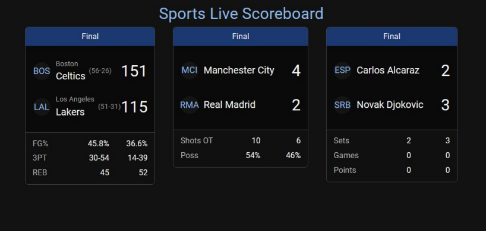

# Sports Live Scoreboard

A real-time multi-sport scoreboard web app for NBA basketball, Champions League football, and tennis.

---



---

## Features
- Live simulation of NBA, football, and tennis scores and stats
- Responsive, clean UI for all sports
- Automatic updates every few seconds
- Easy to extend for more sports or real APIs

## Getting Started

### 1. Clone the repository
```sh
# Example:
git clone <your-repo-url>
```

### 2. Install dependencies
```sh
cd scoreboard-server
npm install
cd ../scoreboard-client
npm install
```

### 3. Run the servers
- **Backend:**
  ```sh
  cd scoreboard-server
  node server.js
  ```
- **Frontend:**
  ```sh
  cd scoreboard-client
  npm run dev
  ```

### 4. Open in your browser
Visit [http://localhost:5173](http://localhost:5173) (or the port shown in your terminal).

## Project Structure
```
scoreboard-server/    # Node.js/Express backend (simulates live data)
scoreboard-client/    # React frontend (displays live scores)
```

## Add Your Screenshot
Replace `scoreboard-client/public/screenshot.png` with your app screenshot to display it above.

---

## License
MIT